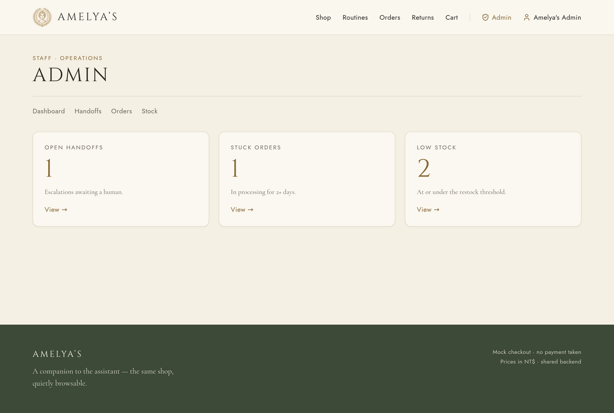
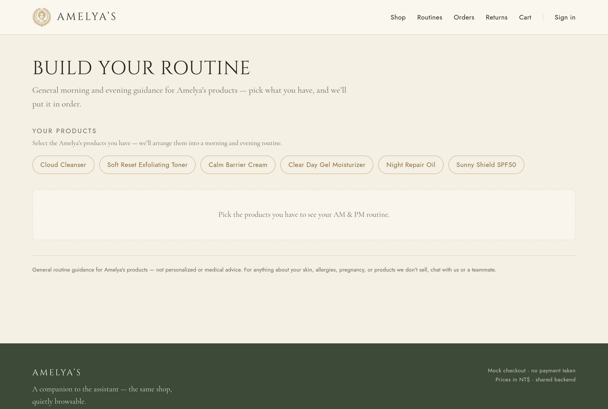
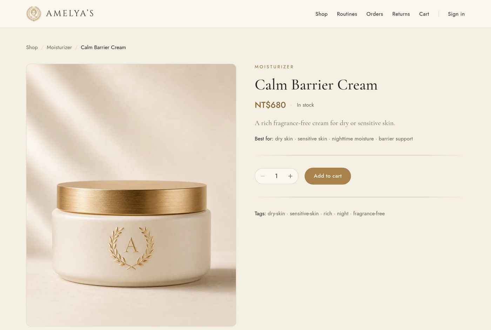
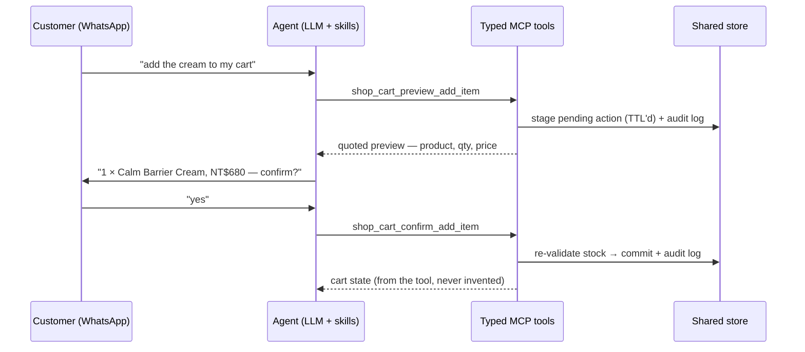
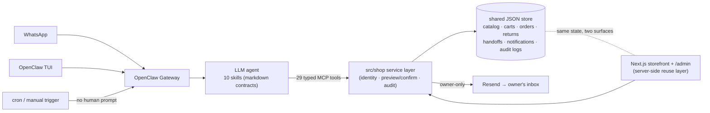

<div align="center">
  

  # DeskClaw

  **An AI customer-service agent that runs a real (mock) shop — with hard safety rails.**

  *Skills → typed tools → shared data. The agent can sell, support, and escalate — but it can't touch money, and it never acts without your "yes".*

  [](https://github.com/Lelevinson/deskclaw/actions/workflows/ci.yml)
  
  
  
  

</div>

---

DeskClaw is a personal project exploring a question I find more interesting than "can an LLM chat?": **how do you let an AI agent *act* on a business — carts, orders, escalations, email — without ever having to trust it blindly?**

The answer built here: a conversational commerce agent for a small skincare brand (**Amelya's**, the demo store) that customers reach over **real WhatsApp** or a terminal chat. It recommends products, builds skincare routines, edits carts, places mock orders, intakes returns, and escalates angry or medical conversations to a human — every action flowing through **typed MCP tools** with **preview → confirm → audit** consent gates, identity checks bound to the messaging channel, and a hard no-go zone around money. A **Next.js storefront and admin panel share the same backend**, so what the agent does in chat is instantly visible (and fixable) in the browser.

## See it

<table>
  <tr>
    <td width="50%">
      
      <p align="center"><sub><b>The storefront</b> — Next.js 15 over the same backend the agent uses</sub></p>
    </td>
    <td width="50%">
      
      <p align="center"><sub><b>The admin panel</b> — a human works the queues the agent surfaces but never acts on</sub></p>
    </td>
  </tr>
  <tr>
    <td width="50%">
      
      <p align="center"><sub><b>/routines</b> — deterministic web routine builder, faithful to the brand's compatibility data</sub></p>
    </td>
    <td width="50%">
      
      <p align="center"><sub><b>Product detail</b> — live stock straight from the shared store</sub></p>
    </td>
  </tr>
</table>

And the agent side — a real exchange over WhatsApp (the **routine concierge** chaining catalog search → compatibility rules → stock → budget in one ask):

> **Customer:** Can you put together a simple skincare routine for dry skin, under NT$2000?
>
> **Agent:** Here's a simple dry-skin routine under NT$2000 — **AM:** Cloud Cleanser NT$420, Calm Barrier Cream NT$680, Sunny Shield SPF50 NT$520 (last step) · **PM:** Cloud Cleanser, Calm Barrier Cream. **Total NT$1,620**, within your budget. I skipped the Night Repair Oil because it's currently out of stock.
>
> **Customer:** Yes, add the whole routine to my cart.
>
> **Agent:** I can add the full bundle: 1 × Cloud Cleanser NT$420, 1 × Calm Barrier Cream NT$680, 1 × Sunny Shield SPF50 NT$520 — **NT$1,620**. Please confirm: should I add all 3 items to your cart?
>
> **Customer:** Yes, confirm.
>
> **Agent:** Done — all three are in your cart. *(three previews staged, three confirms committed, six audit-log entries written)*

Every line of that is grounded: the prices come from the catalog, the AM/PM ordering from the brand's compatibility file, the out-of-stock honesty from live stock — and nothing entered the cart until the explicit "yes".

## What the agent can do

**10 skills** drive the behavior, each a markdown contract over **29 typed MCP tools**:

| | Skill | What it does |
|---|---|---|
| 🛍️ | `search-products` | Recommends from the catalog by need, budget, skin type — only real products |
| 🧴 | `routine-concierge` | One ask → full AM/PM regimen → offers the bundle to cart (multi-tool chaining) |
| 📋 | `policy-oracle` | Shipping/returns/FAQ + product-compatibility answers, strictly from brand data |
| 🛒 | `cart-actions` | Add / remove / change quantity — every mutation preview → confirm → audit |
| 💳 | `checkout` | Cart → mock order (stock decremented, cart cleared, **no payment exists**) |
| 📦 | `order-status` | "Where's my order?" — identity-gated, own orders only |
| ↩️ | `returns-actions` | Return *requests* + refund status reads — never issues the refund itself |
| 🙋 | `account-registration` | Self-service signup / account linking from chat, bound to the channel identity |
| 🚨 | `sentiment-router` | Classifies frustration & safety language, files durable escalation records |
| 📨 | `ops-digest` | **Proactive**: a schedule wakes the agent with no human prompt; it inspects the store and emails the owner a morning ops digest it composes itself |

Plus the human side: when the agent escalates or an order is placed, the owner gets a **real email** (Resend), opens the **admin panel**, and resolves the handoff / advances the order / restocks — closing the loop the agent opened.

## The interesting part: the safety model

Anyone can wire an LLM to tools. The design work here is in what the agent **can't** do:



- **Preview → confirm → audit, structurally.** Mutations are two separate tools. The preview stages a server-side pending action; the confirm re-validates (ownership, expiry, stock) and writes an audit log either way. The agent *cannot* skip the gate, because no single tool both decides and acts.
- **Identity comes from the channel, never the customer's words.** Your WhatsApp number resolves through an account-links table; typing someone's account id proves nothing. Unlinked senders get routed to registration, not served.
- **A hard no-go zone.** No refunds, no cancellations, no address changes, no payment — researched as the top agent-abuse surfaces and excluded *by construction* (the tools don't exist). The agent intakes and hands off; humans move money.
- **Answer only from data.** Products, prices, policies, and ingredient-compatibility all come from versioned data files. The skills treat "not in the data" as "say it's not covered", and the medical/allergy/pregnancy boundary escalates to a human instead of answering — every escalation a durable, queryable record.
- **Owner-only outbound.** The email tool has **no recipient parameter** — `to` is always the owner from env. A prompt-injected "email this customer" is structurally impossible.
- **Proactive ≠ more authority.** The scheduled ops digest reads ops data and notifies the owner. Same rails, zero new write paths.

## Architecture



Three layers keep new capabilities cheap: a **skill** (what to do, in markdown) calls **typed tools** (how it's allowed to happen, in TypeScript) over **shared data** (what's true, in versioned files). The storefront doesn't reimplement shop logic — it imports the same service layer server-side, so chat and web literally cannot disagree about state.

## How it's tested

Two eval layers, because an agent has two failure modes — wrong code and wrong judgment:

- **`npm run shop:eval` — 97 deterministic assertions** over the service layer: identity gating, ownership isolation (no existence leaks), preview/confirm contracts, double-confirm and expiry refusals, stock re-validation, audit-log writes, bundle-add invariants, cross-channel account linking, owner-only email with dedupe. Runs in CI on every push.
- **`npm run agent:eval` — 14 model-in-the-loop cases** driving the *real* LLM through the gateway: does it route to the right skill, answer only from data, refuse to invent carriers, create the handoff record on a pregnancy question, preview-then-confirm a bundle, and stay quiet about upsells when the customer is angry? Rule-based assertions (tool calls made, store deltas, reply regexes) — no LLM judge.

This split caught real bugs: a race where parallel bundle previews clobbered each other in the JSON store (fixed by serializing tool execution in the MCP server), and a persona tweak that made the agent *verbally* promise escalation without filing the record.

## Run it yourself

The project is devcontainer-first — Docker + VS Code is the whole setup story.

```bash
# 1. Clone, copy .env.example → .env, open in VS Code → "Reopen in Container"
# 2. One-time OpenClaw config (models, skills dir, shop MCP server):
#    follow docs/openclaw/setup.md §2–§4
npm install && npm run build
npm run shop:reset       # seed the demo shop
openclaw gateway         # start the agent gateway (one terminal)
openclaw tui             # chat with the agent (another terminal)

cd web && npm install && npm run dev   # storefront on :3000
```

Demo logins: customer `lin` / `amelya-demo` · admin `admin` / `amelya-admin`. Model options (local Ollama or `gpt-5.5` via the Codex provider), WhatsApp connection, and troubleshooting all live in [`docs/openclaw/setup.md`](docs/openclaw/setup.md). Scenario scripts to try every skill: [`skills-lab/scenarios/`](skills-lab/scenarios/).

## Repository map

```text
README.md                 # you are here
ARCHITECTURE.md           # scope, stack, status, resolved decisions — the source of truth
AGENTS.md                 # contributor rules + topic→file map
skills/                   # the 10 agent skills (markdown contracts) — canonical
src/shop/                 # service layer: identity, preview/confirm, audit, notify
src/mcp/shop-server.ts    # the 29 typed MCP tools (serialized execution)
src/cli/                  # shop-eval, agent-eval, ops-digest trigger
data/                     # catalog, policies, compatibility, customers, shop state
web/                      # Next.js storefront + /admin (server-side reuse of src/shop)
skills-lab/               # per-skill demo scenarios with pass/fail criteria
docs/                     # setup, planning history, assets
```

| You want to know… | Open |
|---|---|
| What's in scope, the stack, what's done | [`ARCHITECTURE.md`](ARCHITECTURE.md) |
| How the storefront reuses the backend | [`web/README.md`](web/README.md) |
| What each skill does | [`skills/README.md`](skills/README.md) |
| OpenClaw install / config / commands / fixes | [`docs/openclaw/setup.md`](docs/openclaw/setup.md) |
| How to demo every skill | [`skills-lab/README.md`](skills-lab/README.md) |
| How to work in this repo | [`AGENTS.md`](AGENTS.md) |

## Stack

**TypeScript** (strict, ESM) · **OpenClaw** (agent runtime, gateway, WhatsApp channel) · **MCP** (`@modelcontextprotocol/sdk`) · **Next.js 15** + Tailwind + shadcn/ui · **Resend** (owner email) · a deliberately boring **JSON file store** · **Puppeteer** (visual review tooling) · GitHub Actions CI. Models: `gpt-5.5` via the Codex provider, or local **Ollama**.

## Honest limitations

This is a prototype that takes its *boundaries* seriously, not a production system:

- **Account linking is demo-grade.** Linking an existing account uses a per-account code as an OTP stand-in; there's no real out-of-band verification.
- **"Proactive" is local-first.** The scheduled digest fires while the machine and gateway are up — there is no always-on server.
- **The JSON store is single-machine.** Tool execution is serialized in-process; it's not a database and doesn't pretend to be.
- **Model-in-the-loop evals are not deterministic.** A case can flake; the deterministic layer is the gate, the agent layer is the smoke alarm.
- **The agent's voice is machine-local.** Conduct rules ship in `skills/`; the persona (a warm, dash-averse "Amelya's customer care" tone) lives in OpenClaw's workspace files (`SOUL.md` / `IDENTITY.md`). The canonical copy is in [`docs/persona.md`](docs/persona.md) so the voice is reproducible from the repo.

## Credits

Built by [@Lelevinson](https://github.com/Lelevinson), [@carleneamelya](https://github.com/carleneamelya), and [@fkilr50](https://github.com/fkilr50) as a hands-on study of AI-agent design. Developed with [Claude Code](https://claude.com/claude-code) and run on [OpenClaw](https://openclaw.ai). Product photography and the DeskClaw mascot are AI-generated for this demo; **Amelya's** is a fictional brand.

Licensed under the [MIT License](LICENSE).
